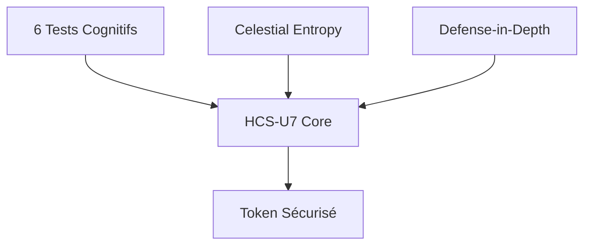
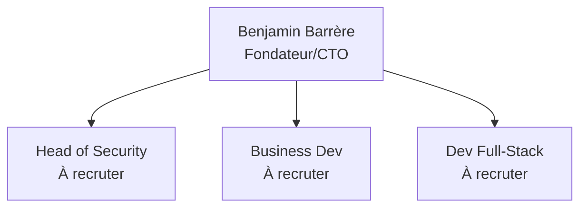

# Guide Visuel pour le Pitch Deck HCS-U7

## 🎨 Charte Graphique

### Palette de Couleurs

```
Couleurs Principales:
- Bleu Électrique: #0066FF (primaire, tech, confiance)
- Noir Profond: #0A0A0A (fond, texte principal)
- Vert Succès: #059669 (métriques positives, validation)
- Blanc Pur: #FFFFFF (texte sur fond sombre)

Couleurs Secondaires:
- Gris Clair: #E5E7EB (séparateurs, backgrounds)
- Orange Alerte: #F97316 (warnings, points d'attention)
- Rouge Danger: #DC2626 (menaces, problèmes)
- Violet: #7C3AED (innovation, IA)
```

### Typographie

```
Police Principale: Inter
- Titres: Inter Bold (48-72pt)
- Sous-titres: Inter SemiBold (32-40pt)
- Corps: Inter Regular (18-24pt)
- Code: JetBrains Mono (16-20pt)

Alternative: SF Pro Display (Apple) ou Roboto (Google)
```

### Icônes

**Bibliothèques Recommandées:**
- Feather Icons (minimaliste, moderne)
- Lucide Icons (fork de Feather, plus d'icônes)
- Tabler Icons (open-source, cohérent)

**Style:** Outline, 2px stroke, arrondi

---

## 📊 Suggestions Visuelles par Slide

### Slide 1: Cover

**Fond:**
- Effet Matrix Rain (code vert qui tombe) en arrière-plan
- Overlay gradient noir (opacité 70%) pour lisibilité
- Particules lumineuses bleues (#0066FF) dispersées

**Éléments:**
- Logo HCS-U7 centré (300x300px)
- Titre en Inter Bold 72pt, blanc
- Badges brevets en bas à droite (style GitHub badges)
- Chiffres clés en cercles (diamètre 150px) avec icônes

**Outils:**
- Fond: Canva (template "Tech Presentation") ou Figma
- Matrix Effect: CodePen (rechercher "Matrix Rain CSS")
- Badges: Shields.io pour le style

**Exemple de Layout:**
```
┌─────────────────────────────────────────┐
│   [Matrix Rain Background]              │
│                                         │
│         [LOGO HCS-U7]                   │
│                                         │
│   HCS-U7: L'Authentification            │
│   que les IA Ne Peuvent Pas Pirater     │
│                                         │
│   ┌────┐  ┌────┐  ┌────┐               │
│   │98.9%│  │ 0% │  │48s │               │
│   └────┘  └────┘  └────┘               │
│                                         │
│              FR2514274 | FR2514546      │
└─────────────────────────────────────────┘
```

---

### Slide 2: Le Problème

**Timeline:**
- Ligne horizontale avec points clés
- Icônes: 🤖 (GPT-3), 🧠 (GPT-4V), 🎭 (bots comportementaux)
- Couleur: Gradient rouge → orange (danger croissant)

**Graphique:**
- Type: Courbe exponentielle
- Axe X: Années (2018-2024)
- Axe Y: Taux de contournement (0-100%)
- Couleur: Rouge (#DC2626)
- Annotations: Points clés (GPT-3, GPT-4V)

**Tableau:**
- Style: Minimaliste avec bordures fines
- Header: Fond bleu (#0066FF), texte blanc
- Rows: Alternance gris clair / blanc
- Icônes: ❌ (rouge), ⚠️ (orange)

**Outils:**
- Timeline: Mermaid.js ou Timeline.js
- Graphique: Chart.js (type: line, tension: 0.4)
- Tableau: Markdown → HTML → Styled

**Code Chart.js:**
```javascript
{
  type: 'line',
  data: {
    labels: ['2018', '2019', '2020', '2021', '2022', '2023', '2024'],
    datasets: [{
      label: 'Taux de contournement CAPTCHA',
      data: [10, 15, 25, 40, 65, 85, 90],
      borderColor: '#DC2626',
      tension: 0.4
    }]
  }
}
```

---

### Slide 3: Notre Solution

**Schéma Architecture:**
- Style: Diagramme en couches (layer cake)
- 3 sections verticales pour les 3 points
- Icônes: 🧠 (tests), 🌌 (entropie), 🛡️ (défense)
- Couleurs: Bleu → Violet → Vert (progression)

**Tests Cognitifs:**
- 6 cartes (style card UI)
- Chaque carte: Icône + Nom + Métrique clé
- Hover effect: Légère élévation (shadow)

**Celestial Entropy:**
- Visualisation: Système solaire stylisé
- Planètes avec orbites
- Lignes connectant les positions → hash

**Defense-in-Depth:**
- Diagramme en oignon (16 couches concentriques)
- Centre: "Application"
- Couches: Rate Limiting, WAF, etc.
- Couleurs: Du rouge (extérieur) au vert (intérieur)

**Outils:**
- Diagrammes: Mermaid.js, Excalidraw, ou Figma
- Cards: Tailwind CSS components
- Système solaire: Three.js (simple) ou SVG animé

**Exemple Mermaid (Architecture):**


---

### Slide 4: Preuves et Résultats

**Tableau Comparatif:**
- Style: Moderne avec icônes
- Highlight: Ligne HCS-U7 en vert clair
- Checkmarks: ✅ (vert), ❌ (rouge)
- Chiffres: Bold, grande taille pour HCS-U7

**Graphique Radar:**
- 6 axes: Détection, Faux Positifs, Temps, Conformité, Résistance IA, Prix
- 3 polygones: reCAPTCHA (rouge), Cloudflare (orange), HCS-U7 (vert)
- Remplissage: Opacité 20%

**Siege Wall:**
- Capture d'écran réelle du dashboard
- Encadré en vert (#059669)
- Badge "LIVE" clignotant en haut à droite
- Compteur "0 breaches" en très gros

**Outils:**
- Radar: Chart.js (type: radar)
- Tableau: Styled HTML ou Notion export
- Capture: Screenshot du Siege Wall + Figma pour annotations

**Code Chart.js (Radar):**
```javascript
{
  type: 'radar',
  data: {
    labels: ['Détection', 'Faux Positifs', 'Temps', 'Conformité', 'Résistance IA', 'Prix'],
    datasets: [
      {
        label: 'HCS-U7',
        data: [99.6, 97.8, 40, 100, 98.9, 60],
        borderColor: '#059669',
        backgroundColor: 'rgba(5, 150, 105, 0.2)'
      },
      {
        label: 'reCAPTCHA',
        data: [87.5, 85, 90, 20, 15, 100],
        borderColor: '#DC2626',
        backgroundColor: 'rgba(220, 38, 38, 0.2)'
      }
    ]
  }
}
```

---

### Slide 5: Cas d'Usage

**Tableau Secteurs:**
- Style: Cards avec icônes sectorielles
- Icônes: 🏦 (banque), 🛡️ (défense), 🛒 (e-commerce), etc.
- Couleur par secteur (bleu, vert, orange, violet, gris)
- Impact en gros chiffres (-90%, -85%)

**Logos Partenaires:**
- Disposition: Grille 3x2
- Logos en niveaux de gris (sauf hover)
- Taille uniforme (150x80px)
- Espacement généreux

**Schéma Intégration:**
- Diagramme de flux
- Boxes: Frontend → HCS-U7 SDK → Backend → Database
- Flèches avec labels (API calls, tokens)
- Style: Minimaliste, lignes droites

**Outils:**
- Cards: Tailwind CSS ou Bootstrap
- Logos: Recherche "brand logos SVG" + Figma
- Diagramme: Mermaid.js ou Draw.io

**Exemple Layout (Cards):**
```
┌──────────┬──────────┬──────────┐
│ 🏦       │ 🛡️       │ 🛒       │
│ Banque   │ Défense  │ Commerce │
│ -90%     │ Max Sec  │ -85%     │
└──────────┴──────────┴──────────┘
```

---

### Slide 6: Intégration Technique

**Code Snippets:**
- Style: Carbon.now.sh (fond sombre, syntax highlighting)
- Thème: Dracula ou One Dark Pro
- Taille: 18-20pt (lisible à distance)
- Numéros de ligne: Oui

**Dashboard Screenshot:**
- Capture du dashboard développeur
- Annotations: Flèches pointant vers les features clés
- Encadré: Bordure bleue (#0066FF)

**Icônes SDK:**
- Python logo + JavaScript logo
- Taille: 64x64px
- Disposition: Côte à côte avec labels

**Timeline Déploiement:**
- 3 étapes: Install → Configure → Deploy
- Icônes: 📦, ⚙️, 🚀
- Temps estimé sous chaque étape

**Outils:**
- Code: Carbon.now.sh ou Ray.so
- Screenshots: Capture + Figma pour annotations
- Timeline: CSS custom ou Mermaid

**Exemple Carbon.now.sh Settings:**
```
Theme: Dracula
Language: JavaScript
Font: JetBrains Mono
Padding: 64px
Background: Yes
```

---

### Slide 7: Business Model

**Camembert (Allocation Fonds):**
- 4 segments: 40%, 30%, 20%, 10%
- Couleurs: Bleu, Vert, Violet, Orange
- Labels: Pourcentage + Montant (€)
- Style: 3D léger (pas trop kitsch)

**Tableau Projections:**
- 3 lignes (2025, 2026, 2027)
- Colonnes: Année, Clients, CA, Croissance
- Graphique sparkline dans la colonne Croissance
- Highlight: 2027 (objectif final)

**Logos Partenaires:**
- Windsurf, AWS, Stripe, Auth0
- Disposition: Ligne horizontale
- Effet: Grayscale → Color on hover

**Graphique Croissance CA:**
- Type: Barre ou courbe
- Couleur: Gradient bleu → vert
- Annotations: Milestones (certifications, expansion)

**Outils:**
- Camembert: Chart.js (type: doughnut)
- Tableau: Excel → Export image ou HTML styled
- Graphique: Chart.js (type: bar)

**Code Chart.js (Camembert):**
```javascript
{
  type: 'doughnut',
  data: {
    labels: ['Certifications', 'Équipe', 'R&D', 'Marketing'],
    datasets: [{
      data: [40, 30, 20, 10],
      backgroundColor: ['#0066FF', '#059669', '#7C3AED', '#F97316']
    }]
  }
}
```

---

### Slide 8: Roadmap

**Timeline Visuelle:**
- Ligne horizontale avec 3 points (Q4 2025, 2026, 2027)
- Icônes: 🏆 (certifications), 🌍 (expansion), 🤝 (partenariats)
- Couleurs: Bleu → Vert (progression)
- Milestones en boxes au-dessus de la ligne

**Carte du Monde:**
- Zones colorées: Europe (vert), US (bleu), Asie (violet)
- Flèches indiquant l'expansion
- Style: Minimaliste, pas de détails géographiques

**Checklist:**
- Style: Checkbox avec checkmarks
- Icônes: ✅ (complété), 🔄 (en cours), 📅 (prévu)
- Groupé par phase

**Outils:**
- Timeline: Timeline.js ou CSS custom
- Carte: Mapbox GL JS (simple) ou SVG statique
- Checklist: HTML/CSS styled

**Exemple Timeline (CSS):**
```css
.timeline {
  display: flex;
  justify-content: space-between;
  position: relative;
}
.timeline::before {
  content: '';
  position: absolute;
  height: 4px;
  background: linear-gradient(to right, #0066FF, #059669);
}
```

---

### Slide 9: L'Équipe

**Photos Équipe:**
- Style: Cercles (150x150px)
- Bordure: 4px, couleur #0066FF
- Disposition: Ligne horizontale
- Hover: Légère élévation + info tooltip

**Organigramme:**
- Boxes pour chaque membre
- Lignes connectant les rôles
- Boxes "À recruter" en pointillés
- Couleurs: Bleu (existant), Gris (à recruter)

**Logos Employeurs:**
- Anciens employeurs (BNP, Thales, CNRS)
- Taille: 100x50px
- Grayscale avec léger blur
- Disposition: Grille sous les photos

**Badges Expertise:**
- Style: GitHub skill badges
- Exemples: "15 ans IA", "2 brevets", "Expert Crypto"
- Couleurs: Bleu (#0066FF)

**Outils:**
- Photos: Figma pour uniformiser (crop circulaire)
- Organigramme: Mermaid.js ou Lucidchart
- Badges: Custom CSS ou Shields.io

**Exemple Mermaid (Organigramme):**


---

### Slide 10: L'Ask

**Camembert Allocation:**
- Identique à Slide 7 mais plus gros
- Annotations: Flèches pointant vers chaque segment
- Montants en euros (200k€, 150k€, etc.)

**Graphique ROI:**
- Type: Courbe avec projection
- Axe X: Années (2025-2030)
- Axe Y: Valorisation (M€)
- Zone "Exit" en vert clair
- Multiplicateur 5-10× annoté

**Logos Investisseurs:**
- Bpifrance, Partech, Kima Ventures, Serena
- Style: Couleur (pas grayscale)
- Disposition: Grille 2x2

**Checklist Milestones:**
- 4 items avec dates
- Icônes: ✅ (Q2 2025), ✅ (Q4 2025), etc.
- Progression bar en bas

**Outils:**
- Camembert: Chart.js (réutiliser Slide 7)
- Graphique ROI: Chart.js (type: line avec annotations)
- Logos: Recherche officielle + Figma

**Code Chart.js (ROI):**
```javascript
{
  type: 'line',
  data: {
    labels: ['2025', '2026', '2027', '2028', '2029', '2030'],
    datasets: [{
      label: 'Valorisation (M€)',
      data: [2.5, 5, 10, 15, 20, 25],
      borderColor: '#059669',
      fill: true,
      backgroundColor: 'rgba(5, 150, 105, 0.1)'
    }]
  },
  options: {
    plugins: {
      annotation: {
        annotations: {
          exitZone: {
            type: 'box',
            xMin: 4,
            xMax: 5,
            backgroundColor: 'rgba(5, 150, 105, 0.2)',
            label: { content: 'Exit Zone', enabled: true }
          }
        }
      }
    }
  }
}
```

---

### Slide 11: Call to Action

**Bouton CTA:**
- Taille: Large (200x60px)
- Couleur: Bleu (#0066FF)
- Texte: "Réserver une Démo" en blanc, bold
- Hover: Légère élévation + couleur plus claire
- Icône: 📅 à gauche du texte

**QR Code:**
- Taille: 300x300px
- Couleur: Noir sur blanc
- Bordure: 4px bleu (#0066FF)
- Label en dessous: "Scannez pour réserver"

**Coordonnées:**
- Style: Cards avec icônes
- Icônes: 📧 (email), 📱 (tel), 💼 (LinkedIn)
- Taille texte: 24pt (très lisible)
- Couleur: Bleu (#0066FF) pour les liens

**Sections:**
- 3 colonnes: Investisseurs | Partenaires | Presse
- Séparateurs verticaux fins
- Icônes en haut de chaque colonne

**Outils:**
- Bouton: CSS custom (border-radius: 8px, box-shadow)
- QR Code: qr-code-generator.com ou QRCode.js
- Cards: Tailwind CSS

**Exemple CSS (Bouton CTA):**
```css
.cta-button {
  background: #0066FF;
  color: white;
  padding: 20px 40px;
  border-radius: 8px;
  font-size: 20px;
  font-weight: bold;
  box-shadow: 0 4px 12px rgba(0, 102, 255, 0.3);
  transition: all 0.3s;
}
.cta-button:hover {
  transform: translateY(-2px);
  box-shadow: 0 6px 16px rgba(0, 102, 255, 0.4);
}
```

---

### Slide 12: Annexes

**Grille de Liens:**
- Style: Cards cliquables
- Icônes: 🎮 (Siege Wall), 🧪 (Sandbox), 📖 (Docs), 📜 (Brevets)
- Hover: Légère élévation
- QR codes miniatures (100x100px) dans chaque card

**Tableau FAQ:**
- Style: Accordéon (question → réponse)
- Icônes: ❓ (question), ✅ (réponse)
- Couleurs alternées (blanc/gris clair)

**Témoignages:**
- Style: Quote boxes
- Icône: 💬 en haut à gauche
- Photo du client (si disponible) en cercle
- Nom + Titre en italique

**Badges Certifications:**
- NIST, RGPD, PSD2, AI Act
- Style: Shields.io badges
- Disposition: Ligne horizontale
- Couleurs: Vert (#059669)

**Outils:**
- Cards: Tailwind CSS ou Bootstrap
- Accordéon: JavaScript (collapse/expand)
- Quotes: CSS custom avec border-left colorée

**Exemple CSS (Quote Box):**
```css
.testimonial {
  border-left: 4px solid #0066FF;
  padding: 20px;
  background: #F9FAFB;
  font-style: italic;
  position: relative;
}
.testimonial::before {
  content: '"';
  font-size: 48px;
  color: #0066FF;
  position: absolute;
  top: -10px;
  left: 10px;
}
```

---

### Slide 13: Démonstration Live

**Dashboard Siege Wall:**
- Capture plein écran (1920x1080)
- Annotations: Flèches + labels
- Badge "LIVE" animé (pulsation)
- Compteur "0 breaches" en très gros (72pt)

**Graphiques Temps Réel:**
- Type: Line chart avec animation
- Couleur: Vert (#059669) pour détections
- Rouge (#DC2626) pour attaques
- Mise à jour toutes les secondes (si live)

**Tableau Attaques:**
- 4 lignes (types de bots)
- Colonnes: Type, Volume, Détection, Breaches
- Progress bars pour la détection
- Checkmarks verts pour 0 breaches

**Bouton "Lancer Attaque":**
- Style: Similaire au CTA mais rouge
- Icône: ⚔️
- Texte: "Simuler une Attaque"
- Effet: Pulsation légère

**Outils:**
- Capture: Screenshot + Figma
- Graphiques: Chart.js avec live updates
- Animations: CSS keyframes

**Exemple CSS (Badge LIVE):**
```css
.live-badge {
  background: #DC2626;
  color: white;
  padding: 8px 16px;
  border-radius: 4px;
  animation: pulse 2s infinite;
}
@keyframes pulse {
  0%, 100% { opacity: 1; }
  50% { opacity: 0.7; }
}
```

---

### Slide 14: Comparaison Technique

**Tableau Comparatif:**
- Style: Grande table avec 12+ lignes
- Header: Sticky (reste visible au scroll)
- Highlight: Colonne HCS-U7 en vert clair
- Icônes: ✅, ❌, ⚠️ (vert, rouge, orange)
- Chiffres: Bold pour HCS-U7

**Graphique Radar:**
- Identique à Slide 4 mais plus détaillé
- 8 axes au lieu de 6
- Annotations pour chaque axe

**Boxes Analyse:**
- 3 boxes (reCAPTCHA, Cloudflare, HCS-U7)
- Sections: Forces (vert) / Faiblesses (rouge)
- Icônes: ✅ (forces), ❌ (faiblesses)

**Positionnement Matrix:**
- Axe X: Sécurité (0-100)
- Axe Y: UX (0-100)
- Points: reCAPTCHA (bas gauche), Cloudflare (milieu), HCS-U7 (haut droite)
- Quadrants colorés

**Outils:**
- Tableau: HTML styled ou Excel export
- Radar: Chart.js (réutiliser Slide 4)
- Matrix: Chart.js (type: scatter)

**Code Chart.js (Scatter Matrix):**
```javascript
{
  type: 'scatter',
  data: {
    datasets: [
      { label: 'reCAPTCHA', data: [{x: 40, y: 60}], backgroundColor: '#DC2626' },
      { label: 'Cloudflare', data: [{x: 70, y: 80}], backgroundColor: '#F97316' },
      { label: 'HCS-U7', data: [{x: 95, y: 65}], backgroundColor: '#059669' }
    ]
  },
  options: {
    scales: {
      x: { title: { display: true, text: 'Sécurité' } },
      y: { title: { display: true, text: 'UX' } }
    }
  }
}
```

---

### Slide 15: Étude de Cas

**Avant/Après:**
- 2 colonnes: Avant HCS-U7 | Après HCS-U7
- Couleurs: Rouge (avant) / Vert (après)
- Icônes: ❌ (avant), ✅ (après)
- Chiffres en gros (72pt)

**Graphique Évolution:**
- Type: Line chart
- 2 courbes: Fraude (descendante), Satisfaction (ascendante)
- Zone "Déploiement HCS-U7" en gris clair
- Annotations: -90%, +17 pts

**Box ROI:**
- Style: Card avec bordure verte
- Calcul: Coûts vs. Gains
- Résultat: ROI Net en très gros (96pt)
- Multiplicateur: 23× en badge

**Témoignage Client:**
- Style: Quote box (comme Slide 12)
- Photo du CTO (si disponible)
- Logo de l'entreprise (flouté si confidentiel)

**Timeline Déploiement:**
- 3 phases: Intégration (2 sem) → Tests (1 mois) → Production (3 mois)
- Icônes: 🔧, 🧪, 🚀
- Progress bar sous chaque phase

**Outils:**
- Avant/Après: CSS Grid (2 colonnes)
- Graphique: Chart.js (type: line, 2 datasets)
- Timeline: CSS custom

**Exemple Layout (Avant/Après):**
```
┌──────────────┬──────────────┐
│ AVANT        │ APRÈS        │
├──────────────┼──────────────┤
│ ❌ 12% fraude│ ✅ 1.2%      │
│ ❌ 15% FP    │ ✅ 2.5%      │
│ ❌ 600k€/an  │ ✅ 60k€/an   │
└──────────────┴──────────────┘
```

---

### Slide 16: Merci

**Layout Centré:**
- Logo HCS-U7 en haut (200x200px)
- Titre "Merci !" en très gros (96pt)
- Sous-titre: "Rejoignez la Révolution..."

**QR Code:**
- Taille: 400x400px (très grand)
- Centré
- Label: "Réservez une Démo" en dessous

**Coordonnées:**
- Style: Cards horizontales
- Icônes: 📧, 📱, 💼, 🌐
- Taille texte: 28pt (très lisible)
- Espacement généreux

**Badges:**
- FR2514274, FR2514546, Open-Core, PSD2
- Disposition: Ligne horizontale en bas
- Style: Shields.io
- Couleurs: Bleu (#0066FF)

**Fond:**
- Gradient subtil (bleu foncé → noir)
- Particules lumineuses (comme Slide 1)
- Effet: Élégant, professionnel

**Outils:**
- Layout: Figma ou PowerPoint
- QR Code: Grande taille, haute résolution
- Badges: Shields.io ou custom SVG

**Exemple CSS (Layout Centré):**
```css
.thank-you-slide {
  display: flex;
  flex-direction: column;
  align-items: center;
  justify-content: center;
  min-height: 100vh;
  background: linear-gradient(135deg, #0A0A0A 0%, #0066FF 100%);
  color: white;
  text-align: center;
}
```

---

## 🛠️ Outils Recommandés

### Design & Prototypage
- **Figma** (gratuit) : Design complet, collaboration
- **Canva** (freemium) : Templates prêts à l'emploi
- **Beautiful.ai** (payant) : Pitch decks automatiques

### Graphiques & Visualisations
- **Chart.js** (gratuit) : Graphiques interactifs
- **D3.js** (gratuit) : Visualisations avancées
- **Mermaid.js** (gratuit) : Diagrammes en Markdown

### Code & Screenshots
- **Carbon.now.sh** (gratuit) : Code snippets élégants
- **Ray.so** (gratuit) : Alternative à Carbon
- **Excalidraw** (gratuit) : Diagrammes hand-drawn

### Icônes & Images
- **Feather Icons** (gratuit) : Icônes minimalistes
- **Unsplash** (gratuit) : Photos haute qualité
- **Shields.io** (gratuit) : Badges personnalisés

### Animations
- **Lottie** (gratuit) : Animations JSON
- **GSAP** (freemium) : Animations JavaScript
- **CSS Animations** (gratuit) : Natif

### Export & Présentation
- **PowerPoint** : Export en PPTX
- **Google Slides** : Collaboration en ligne
- **Reveal.js** (gratuit) : Présentations HTML

---

## 📐 Dimensions & Formats

### Slides
- **Ratio** : 16:9 (1920x1080px)
- **Marges** : 80px de chaque côté
- **Zone sûre** : 1760x920px

### Éléments
- **Titres** : 72pt (max 2 lignes)
- **Sous-titres** : 40pt
- **Corps** : 24pt (min 18pt)
- **Icônes** : 64x64px (grandes), 32x32px (petites)
- **Logos** : 150x80px (partenaires), 300x300px (HCS-U7)
- **QR Codes** : 300x300px (min), 400x400px (recommandé)

### Espacement
- **Entre éléments** : 40px (min)
- **Entre sections** : 80px
- **Padding cards** : 32px

---

## ✅ Checklist Avant Export

### Contenu
- [ ] Tous les chiffres sont à jour
- [ ] Pas de fautes d'orthographe
- [ ] Liens fonctionnels (QR codes testés)
- [ ] Captures d'écran haute résolution

### Design
- [ ] Charte graphique respectée
- [ ] Contraste suffisant (WCAG AA)
- [ ] Icônes cohérentes (même style)
- [ ] Alignement parfait (grille)

### Technique
- [ ] Export en PDF haute qualité (300 DPI)
- [ ] Polices embarquées
- [ ] Images optimisées (<500 KB/slide)
- [ ] Animations testées (si présentation live)

### Accessibilité
- [ ] Texte alternatif pour les images
- [ ] Taille de police lisible (min 18pt)
- [ ] Couleurs accessibles (contraste 4.5:1)
- [ ] Pas de clignotement rapide

---

## 🎯 Conseils Finaux

### Do's ✅
- Utiliser des visuels de haute qualité
- Rester cohérent (couleurs, polices, icônes)
- Aérer les slides (white space)
- Tester sur grand écran (projecteur)
- Préparer une version PDF backup

### Don'ts ❌
- Surcharger les slides (max 3 points/slide)
- Utiliser trop de polices (max 2)
- Animations excessives (distraction)
- Texte trop petit (<18pt)
- Images pixelisées

### Pro Tips 💡
- **Rule of Thirds** : Placer les éléments clés sur les intersections
- **Contrast** : Fond sombre + texte clair = meilleure lisibilité
- **Hierarchy** : Taille = Importance
- **Consistency** : Même layout pour slides similaires
- **Storytelling** : Chaque slide raconte une partie de l'histoire

---

**Version** : 1.0
**Date** : Décembre 2024
**Auteur** : Benjamin Barrère - IA Solution
